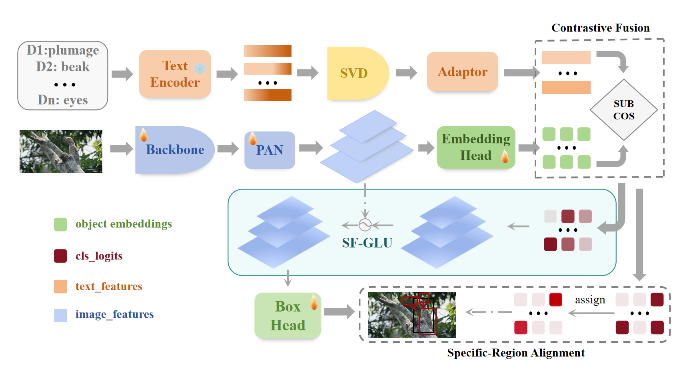

# SDDF: Specificity-Driven Dynamic Focusing for Open-Vocabulary Camouflaged Object Detection (CVPR 2026)

 

> **🚧 Update (2026):** Our paper has been accepted by CVPR 2026! **The code and dataset (OVCOD-D) are coming soon. Please stay tuned!** ## 📖 Introduction

Open-vocabulary object detection (OVOD) has demonstrated strong zero-shot generalization capabilities. However, when dealing with **camouflaged objects**, detectors often fail to distinguish and localize targets because their visual features are highly similar to the background. 

To bridge this gap, we construct a new benchmark named **OVCOD-D** and propose **SDDF** (Specificity-Driven Dynamic Focusing). Our method addresses the two main challenges in open-vocabulary camouflaged object detection:
1. **Noisy Textual Embeddings:** We design a sub-description principal component contrastive fusion strategy (using SVD) to filter out confusing and overly decorative modifiers.
2. **Highly Similar Visual Embeddings:** We propose a specificity-guided regional weak alignment and dynamic focusing method (SF-GLU module) to strengthen the detector's ability to discriminate camouflaged objects from the background.

Under the open-set evaluation setting, **SDDF achieves a State-of-the-Art AP of 56.4 on the OVCOD-D benchmark.**

## ⚙️ Architecture

*Figure: Overall architecture of the proposed specificity-driven open-vocabulary camouflaged object detector. Fine-grained textual sub-descriptions are decorrelated via SVD, refined, and integrated with visual object embeddings.*

## 🏆 Main Results

### 1. Comparison with Open-Vocabulary Object Detectors
We compare SDDF with classical open-vocabulary object detectors on the OVCOD-D dataset under an open-set setting. All models are fine-tuned on the base classes and evaluated on the union of base and novel classes.

| Method | Backbone | Params | Pre-train | AP | AP50 | AP75 | APm | APl |
| :--- | :---: | :---: | :---: | :---: | :---: | :---: | :---: | :---: |
| GLIP-T | Swin-T | 232M | O365, GoldG | 39.6 | 47.8 | 45.2 | - | - |
| GLIPv2-T | Swin-T | 232M | O365, GoldG | 42.6 | 53.4 | 46.7 | - | - |
| Grounding DINO-T | Swin-T | 172M | O365, GoldG | 34.8 | 43.9 | 37.7 | - | - |
| YOLO-World-S | YOLOv8-S | 77M | O365, GoldG | 38.5 | 58.0 | 41.4 | 18.7 | 41.1 |
| YOLO-World-M | YOLOv8-M | 92M | O365, GoldG | 43.3 | 62.3 | 46.5 | 24.9 | 46.1 |
| YOLO-World-L | YOLOv8-L | 110M | O365, GoldG | 45.7 | 63.2 | 48.9 | 22.9 | 48.4 |
| YOLOE-S | YOLOv8-S | 78M | O365, GoldG | 38.7 | 46.0 | 40.8 | - | - |
| YOLOE-M | YOLOv8-M | 94M | O365, GoldG | 39.9 | 47.7 | 42.7 | - | - |
| DOSOD-S | YOLOv8-S | 75M | O365, GoldG | 44.8 | 67.4 | 46.8 | 22.4 | 47.2 |
| DOSOD-M | YOLOv8-M | 90M | O365, GoldG | 51.8 | 73.8 | 55.6 | 27.9 | 54.5 |
| DOSOD-L | YOLOv8-L | 108M | O365, GoldG | 53.4 | 73.1 | 56.2 | 26.4 | 56.3 |
| **SDDF-S (Ours)** | **YOLOv8-S** | **76M** | **O365, GoldG** | **48.1** | **70.7** | **50.3** | **25.9** | **50.7** |
| **SDDF-M (Ours)** | **YOLOv8-M** | **91M** | **O365, GoldG** | **54.3** | **75.1** | **57.5** | **30.3** | **57.0** |
| **SDDF-L (Ours)** | **YOLOv8-L** | **109M** | **O365, GoldG** | **56.4** | **76.4** | **60.7** | **34.4** | **59.0** |

### 2. Comparison with SOTA COD Methods
To bridge the gap between segmentation-based COD and bounding-box detection, we also compare SDDF with State-of-the-Art Camouflaged Object Detection methods:

| Method | Backbone | AP | AP50 | AP75 |
| :--- | :---: | :---: | :---: | :---: |
| SINet-V2 | ResNet-50 | 40.2 | 69.3 | 39.4 |
| FSPNet | Swin-T | 47.9 | 76.2 | 49.4 |
| CamoFormer | Swin-T | 55.6 | 80.2 | 59.0 |
| HDPNet | ViT-B | 56.3 | **81.5** | 59.6 |
| **SDDF-L (Ours)** | **YOLOv8-L** | **56.4** | 76.4 | **60.7** |

### Qualitative Performance

*Figure: Visualization of detection bounding boxes and heatmap representations of the response differences with our proposed SF-GLU module.*

## 📧 Contact
If you have any questions, please feel free to contact us or open an issue.
