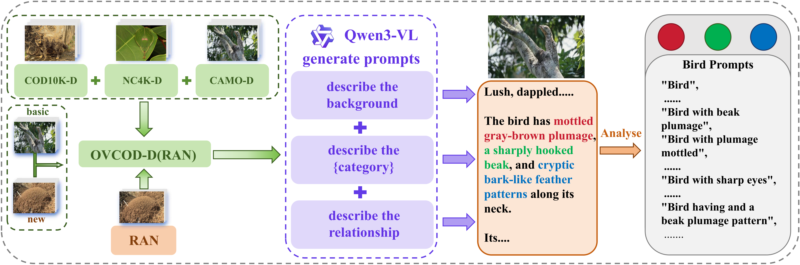
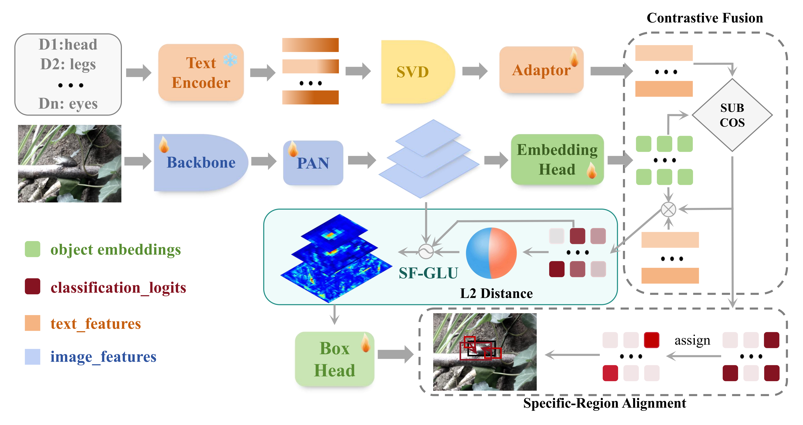
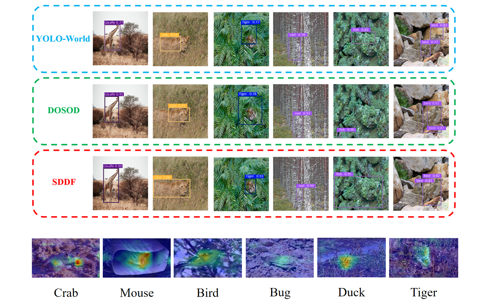

# [cite_start]SDDF: Specificity-Driven Dynamic Focusing for Open-Vocabulary Camouflaged Object Detection (CVPR 2026) [cite: 1]

[](https://opensource.org/licenses/MIT)
[](#) 
[](#)

> **🚧 Update (2026):** Our paper has been accepted by CVPR 2026! **The code and dataset (OVCOD-D) are coming soon. [cite_start]Please stay tuned!** [cite: 15]

## 📖 Introduction

[cite_start]Open-vocabulary object detection (OVOD) aims to detect known and unknown objects in the open world[cite: 6]. [cite_start]However, camouflaged objects pose significant challenges due to high visual similarity with the background[cite: 8]. [cite_start]We propose **SDDF**, which leverages specificity-aware sub-descriptions and a dynamic focusing mechanism to enhance the detector's discrimination capability[cite: 13].

## 📊 OVCOD-D Benchmark


*Figure: Construction pipeline of OVCOD-D dataset. We extend COD10K-D, NC4K-D, and cleaned CAMO-D with YOLO-style detection labels and an additional red imported fire ant nest subset, then reorganize them into 40 base and 47 novel classes. [cite_start]Qwen3-VL-Plus generates fine-grained image descriptions from which we derive a semantic prompt library for open-vocabulary camouflaged object detection. [cite: 209, 210]*

## ⚙️ Architecture


*Figure: Overall architecture of the proposed specificity-driven open-vocabulary camouflaged object detector. [cite: 119]*

## 🏆 Main Results

### 1. Comparison with Open-Vocabulary Object Detectors
Evaluated on the union of base and novel classes on the OVCOD-D dataset[cite: 231].

| Method | Backbone | Params | Pre-train | AP | AP<sub>50</sub> | AP<sub>75</sub> | AP<sub>m</sub> | AP<sub>l</sub> |
| :--- | :---: | :---: | :---: | :---: | :---: | :---: | :---: | :---: |
| GLIP-T | Swin-T | 232M | O365, GoldG | 39.6 | 47.8 | 45.2 | - | - |
| Grounding DINO-T | Swin-T | 172M | O365, GoldG | 34.8 | 43.9 | 37.7 | - | - |
| YOLO-World-L | YOLOv8-L | 110M | O365, GoldG | 45.7 | 63.2 | 48.9 | 22.9 | 48.4 |
| DOSOD-L | YOLOv8-L | 108M | O365, GoldG | 53.4 | 73.1 | 56.2 | 26.4 | 56.3 |
| **SDDF-L (Ours)** | **YOLOv8-L** | **109M** | **O365, GoldG** | **56.4** | **76.4** | **60.7** | **34.4** | **59.0** |
*(Full table available in the paper [cite: 232])*

### 2. Comparison with SOTA COD Methods
Comparison with State-of-the-Art Camouflaged Object Detection methods[cite: 417].

| Method | Backbone | AP | AP<sub>50</sub> | AP<sub>75</sub> |
| :--- | :---: | :---: | :---: | :---: |
| SINet-V2 | ResNet-50 | 40.2 | 69.3 | 39.4 |
| FSPNet | Swin-T | 47.9 | 76.2 | 49.4 |
| CamoFormer | Swin-T | 55.6 | 80.2 | 59.0 |
| HDPNet | ViT-B | 56.3 | **81.5** | 59.6 |
| **SDDF-L (Ours)** | **YOLOv8-L** | **56.4** | 76.4 | **60.7** | [cite: 419]

## 🖼️ Qualitative Results

*Figure: Visualization of detection bounding boxes and heatmap representations[cite: 475, 482].*

## 📧 Contact
If you have any questions, please feel free to contact us or open an issue.

## 📌 Citation
```bibtex
@inproceedings{liang2026sddf,
  title={SDDF: Specificity-Driven Dynamic Focusing for Open-Vocabulary Camouflaged Object Detection},
  author={Liang, Jiaming and Zhan, Yifeng and Liu, Chunlin and Zheng, Weihua and Peng, Bingye and Liang, Qiwei and Cai, Boyang and Mai, Xiaochun and Nie, Qiang},
  booktitle={Proceedings of the IEEE/CVF Conference on Computer Vision and Pattern Recognition (CVPR)},
  year={2026}
}

http://googleusercontent.com/immersive_entry_chip/0

### 💡 记得做这件事：
从论文里截取 **Figure 4**（就是那张有 Qwen 图标和数据流向的图），重命名为 `benchmark_pipeline.png` 放到你仓库的 `assets/` 文件夹下，这样图片就能正常显示了。

如果你后面想要增加 **Installation**（安装）或者 **Data Preparation**（数据准备）的说明，我随时可以帮你写。下一步需要我帮你检查一下你服务器上的 `git` 配置是否正确吗？
