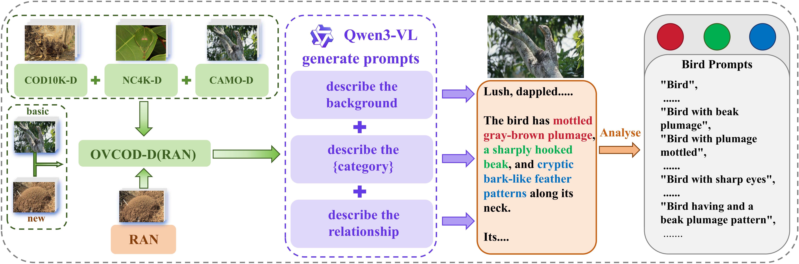
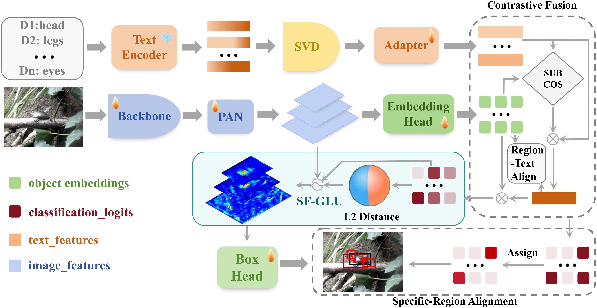
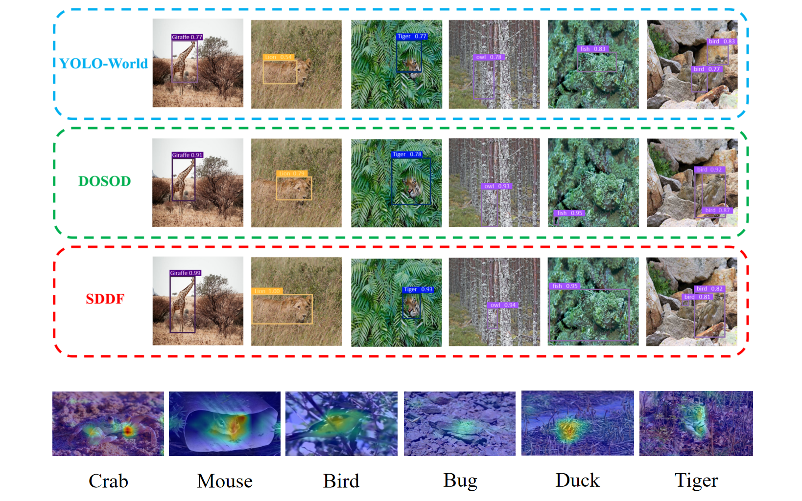

# SDDF: Specificity-Driven Dynamic Focusing for Open-Vocabulary Camouflaged Object Detection (CVPR 2026)

[](https://opensource.org/licenses/MIT)
[](http://arxiv.org/abs/2603.26109)
[](#)
[](https://huggingface.co/datasets/Zhan1fen/OVCOD-D)
[](https://www.modelscope.cn/datasets/yifengzhan/OVCOD-D)

> **🚧 Update:**
> - **[2026/04/13]:** The OVCOD-D benchmark dataset is released on [Hugging Face](https://huggingface.co/datasets/Zhan1fen/OVCOD-D) and [ModelScope](https://www.modelscope.cn/datasets/yifengzhan/OVCOD-D)!
> - **[2026/03/25]:** Repository created. Our paper has been accepted by CVPR 2026! [**[ArXiv Paper]**](http://arxiv.org/abs/2603.26109)
> - **[Coming Soon]:** The training and inference code will be available soon. Stay tuned!

## 📖 Introduction
Open-vocabulary object detection (OVOD) aims to detect known and unknown objects in the open world. However, camouflaged objects pose significant challenges due to high visual similarity with the background. We propose **SDDF**, which leverages specificity-aware sub-descriptions and a dynamic focusing mechanism to enhance the detector's discrimination capability.

## 📊 OVCOD-D Benchmark
[](https://huggingface.co/datasets/Zhan1fen/OVCOD-D)


*Figure: Construction pipeline of OVCOD-D dataset. We extend COD10K-D, NC4K-D, and cleaned CAMO-D with YOLO-style detection labels and an additional red imported fire ant nest subset, then reorganize them into 40 base and 47 novel classes. Qwen3-VL-Plus generates fine-grained image descriptions from which we derive a semantic prompt library for open-vocabulary camouflaged object detection.*

## ⚙️ Architecture

*Figure: Overall architecture of the proposed specificity-driven open-vocabulary camouflaged object detector.*

## 🏆 Main Results

### 1. Comparison with Open-Vocabulary Object Detectors
Evaluated on the union of base and novel classes on the OVCOD-D dataset.

| Method | Backbone | Params | Pre-train | AP | AP<sub>50</sub> | AP<sub>75</sub> | AP<sub>m</sub> | AP<sub>l</sub> |
| :--- | :---: | :---: | :---: | :---: | :---: | :---: | :---: | :---: |
| Grounding DINO-T | Swin-T | 172M | O365, GoldG | 34.8 | 43.9 | 37.7 | - | - |
| YOLOE-M | YOLOv8-M | 94M | O365, GoldG | 39.9 | 47.7 | 42.7 | - | - |
| YOLO-World-L | YOLOv8-L | 110M | O365, GoldG | 45.7 | 63.2 | 48.9 | 22.9 | 48.4 |
| DOSOD-L | YOLOv8-L | 108M | O365, GoldG | 53.4 | 73.1 | 56.2 | 26.4 | 56.3 |
| **SDDF-L (Ours)** | **YOLOv8-L** | **109M** | **O365, GoldG** | **56.4** | **76.4** | **60.7** | **34.4** | **59.0** |

### 2. Comparison with SOTA COD Methods
Comparison with State-of-the-Art Camouflaged Object Detection methods.

| Method | Backbone | AP | AP<sub>50</sub> | AP<sub>75</sub> |
| :--- | :---: | :---: | :---: | :---: |
| SINet-V2 | ResNet-50 | 40.2 | 69.3 | 39.4 |
| FSPNet | Swin-T | 47.9 | 76.2 | 49.4 |
| CamoFormer | Swin-T | 55.6 | 80.2 | 59.0 |
| HDPNet | ViT-B | 56.3 | **81.5** | 59.6 |
| **SDDF-L (Ours)** | **YOLOv8-L** | **56.4** | 76.4 | **60.7** |

## 🖼️ Qualitative Results

*Figure: Visualization of detection bounding boxes and heatmap representations.*

## 📧 Contact
If you have any questions, please feel free to contact us or open an issue.

## 📝 Citation
If you find our work helpful for your research, please consider citing:

```bibtex
@article{liang2026sddf,
  title={SDDF: Specificity-Driven Dynamic Focusing for Open-Vocabulary Camouflaged Object Detection},
  author={Liang, Jiaming and Zhan, Yifeng and Liu, Chunlin and Zheng, Weihua and Peng, Bingye, and Liang, Qiwei and Cai, Boyang and Mai, Xiaochun and Nie, Qiang},
  journal={arXiv preprint arXiv:2603.26109},
  year={2026}
}
```
